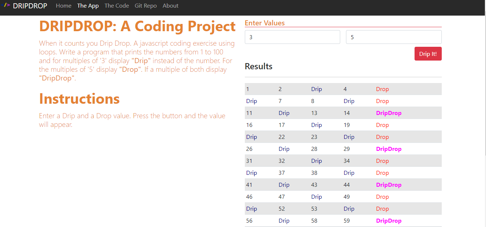

# Drip Drop

## Description 
A javascript coding exercise using loops. When it counts you Drip Drop.

## User Story
As a user, I would like an application that changes displayed numbers to words based on the numbers entered.

## Installation

Clone Repository
- git clone https://github.com/Altheahanson/DripDrop.git

## Technology Used: 

- Bootstrap
- HTML 5
- CSS
- Javascript

## Deployed Application Link
https://drip-drop.netlify.app/app.html
## Images
- 

## License
- This project is govern under the General Public v3.0 License

## Copyright
   (c) Copyright 2022 Althea Hanson 